# Flux Conceptuel Auto — Guide utilisateur

Ce guide explique comment utiliser la **PWA hors-ligne** (`web/app/`, accessible sur `/app/`) : parcourir et écouter les cours de Gilles Deleuze, les télécharger pour une écoute sans connexion, les rechercher, signaler des corrections, et exporter des extraits vers Zotero.

Pour l'architecture technique et le déploiement, voir [../README.md](../README.md) et [../DEPLOYMENT.md](../DEPLOYMENT.md). Ce document-ci s'adresse à qui **utilise** l'application, pas à qui la maintient.

## Sommaire

- [Vue d'ensemble et navigation](#vue-densemble-et-navigation)
- [Parcourir et écouter un cours](#parcourir-et-écouter-un-cours)
- [Télécharger pour écouter hors connexion](#télécharger-pour-écouter-hors-connexion)
- [Rechercher](#rechercher)
- [Reprendre une écoute (Écoutes)](#reprendre-une-écoute-écoutes)
- [Se connecter](#se-connecter)
- [Signaler une correction ou une référence](#signaler-une-correction-ou-une-référence)
- [Retrouver ses annotations](#retrouver-ses-annotations)
- [Extraire un passage vers Zotero](#extraire-un-passage-vers-zotero)
- [Gérer l'espace de stockage](#gérer-lespace-de-stockage)
- [Paramètres](#paramètres)
- [Modèle de données](#modèle-de-données)
- [Questions fréquentes](#questions-fréquentes)

## Vue d'ensemble et navigation

L'application s'organise autour d'une barre d'onglets toujours visible en bas de l'écran (**Catalogue**, **Hors-ligne**, **Recherche**, **Écoutes**, **Espace**) et de deux icônes dans la barre du haut : le **compte** (à droite) et les **paramètres** (engrenage, à côté).

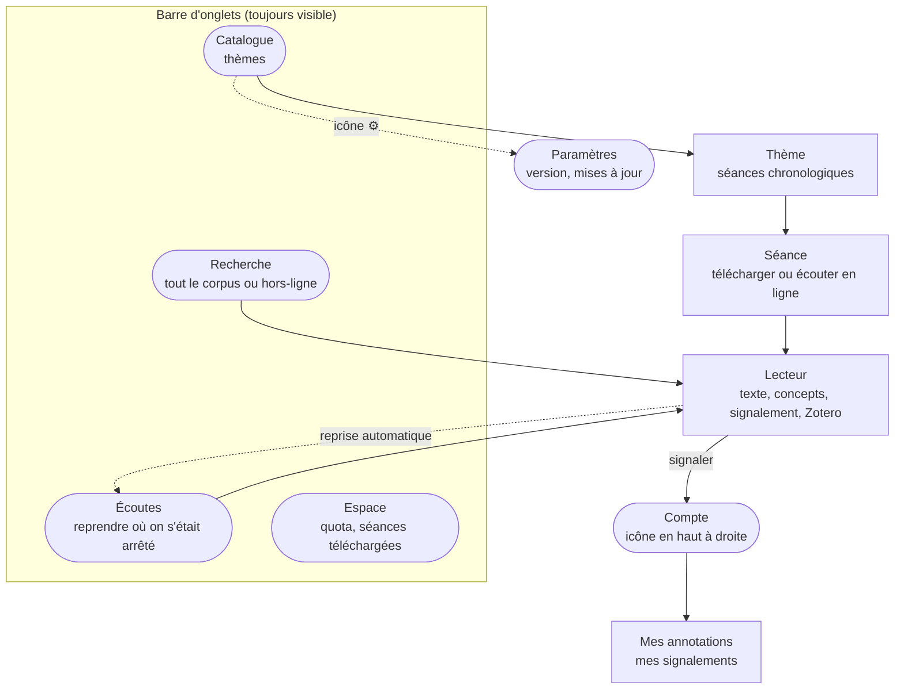
```mermaid
flowchart TB
    Home(["Catalogue<br/>thèmes"]) --> Theme["Thème<br/>séances chronologiques"]
    Theme --> Seance["Séance<br/>télécharger ou écouter en ligne"]
    Seance --> Player["Lecteur<br/>texte, concepts, signalement, Zotero"]
    Search(["Recherche<br/>tout le corpus ou hors-ligne"]) --> Player
    History(["Écoutes<br/>reprendre où on s'était arrêté"]) --> Player
    Player -. reprise automatique .-> History

    Account(["Compte<br/>icône en haut à droite"]) --> Annotations["Mes annotations<br/>mes signalements"]
    Player -- "signaler" --> Account

    Storage(["Espace<br/>quota, séances téléchargées"])
    Settings(["Paramètres<br/>version, mises à jour"])
    Home -. "icône ⚙" .-> Settings

    subgraph TabBar["Barre d'onglets (toujours visible)"]
        Home
        Search
        History
        Storage
    end
```

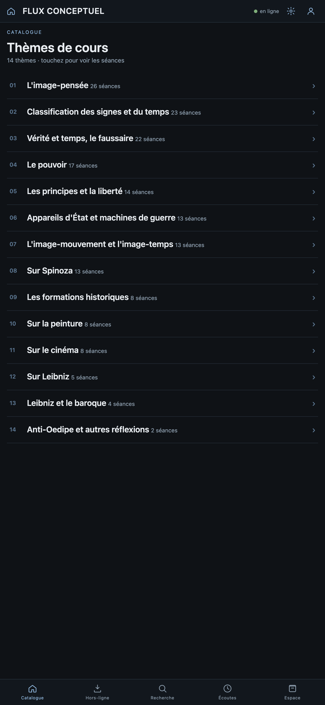
*L'accueil liste les thèmes de cours, du plus fourni au moins fourni. Touchez un thème pour voir ses séances.*

## Parcourir et écouter un cours

Touchez un thème pour voir ses séances, dans l'ordre chronologique :

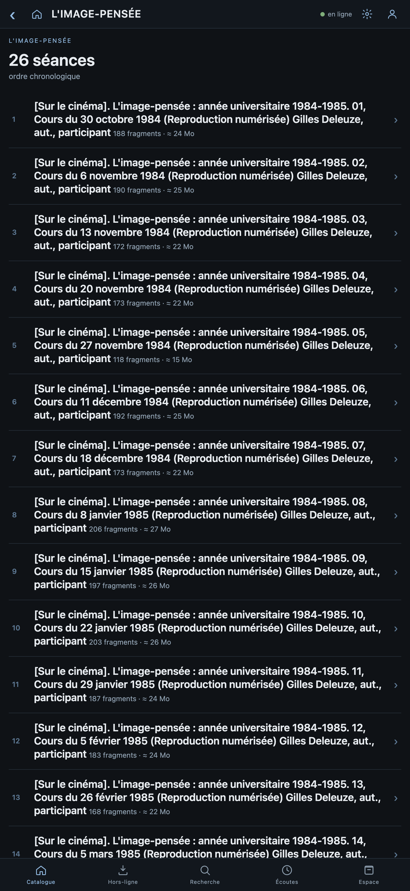
*Chaque ligne indique le numéro de séance et une estimation du poids audio.*

Touchez une séance pour voir son détail : titre complet, date, sujets, et le choix entre télécharger ou écouter directement en ligne.

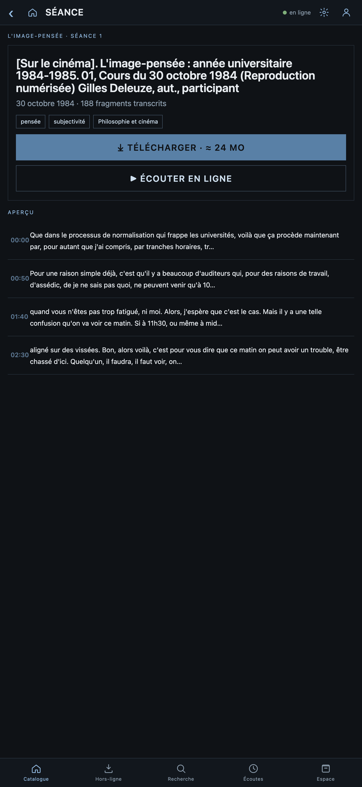
*« Télécharger » enregistre la séance entière sur l'appareil (voir plus bas) ; « Écouter en ligne » lance la lecture en streaming sans rien stocker.*

Une fois la lecture lancée, le texte défile et les concepts détectés dans le fragment courant s'affichent sous forme de pastilles :

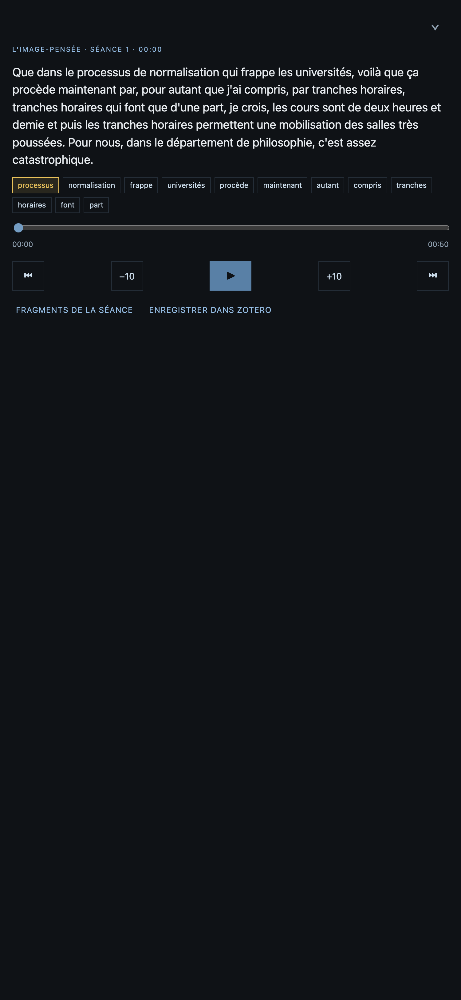
*Barre de progression, ±10 secondes, fragment précédent/suivant. Le lecteur reste accessible (réduit en bas de l'écran) quand vous naviguez ailleurs dans l'app.*

## Télécharger pour écouter hors connexion

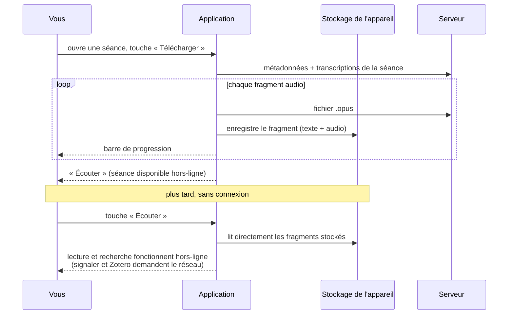
```mermaid
sequenceDiagram
    participant U as Vous
    participant App as Application
    participant IDB as Stockage de l'appareil
    participant API as Serveur

    U->>App: ouvre une séance, touche « Télécharger »
    App->>API: métadonnées + transcriptions de la séance
    loop chaque fragment audio
        App->>API: fichier .opus
        App->>IDB: enregistre le fragment (texte + audio)
        App-->>U: barre de progression
    end
    App-->>U: « Écouter » (séance disponible hors-ligne)

    Note over U,IDB: plus tard, sans connexion
    U->>App: touche « Écouter »
    App->>IDB: lit directement les fragments stockés
    App-->>U: lecture et recherche fonctionnent hors-ligne<br/>(signaler et Zotero demandent le réseau)
```

Le téléchargement peut être annulé en cours de route, et reprend là où il s'est arrêté s'il a été interrompu (un fichier déjà téléchargé n'est jamais retéléchargé). Les séances déjà disponibles hors-ligne portent une pastille dans la liste des séances d'un thème.

## Rechercher

L'onglet **Recherche** propose deux portées : les séances déjà **téléchargées** (fonctionne hors connexion), ou **tout le corpus** (nécessite une connexion). Les mots recherchés sont surlignés dans les extraits de résultat, sans tenir compte des accents.

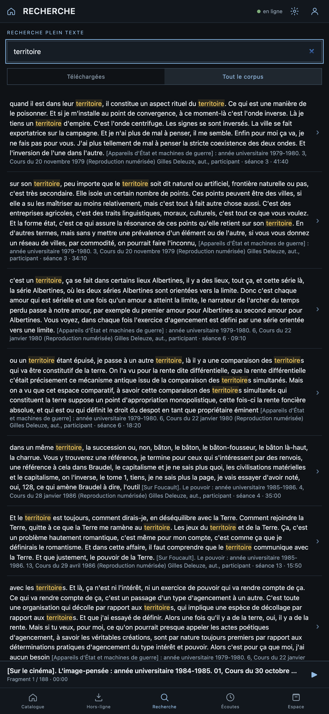
*Touchez un résultat pour ouvrir directement le fragment concerné.*

## Reprendre une écoute (Écoutes)

L'onglet **Écoutes** mémorise, pour chaque séance déjà commencée, le fragment et la position exacts — que la séance soit téléchargée ou juste écoutée en streaming. Touchez une entrée pour reprendre exactement là où vous vous étiez arrêté.

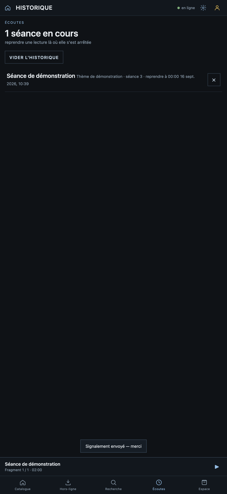
*L'historique est propre à cet appareil et ce navigateur (pas de synchronisation entre appareils).*

## Se connecter

Se connecter permet de **signaler des corrections/références** dans les transcriptions et de **retrouver ses propres signalements**. Deux façons de se connecter, selon ce qui est activé sur le serveur :

- un **compte géré par l'application elle-même** (e-mail + mot de passe) — toujours disponible ;
- un **compte Google**, si le serveur est configuré pour.

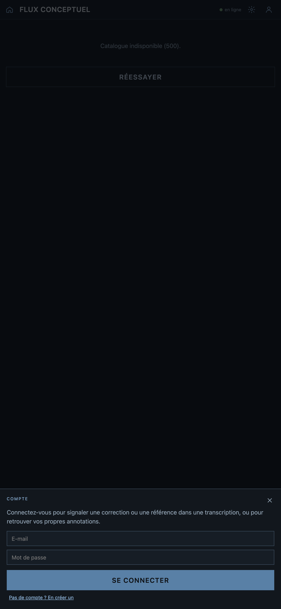
*Icône compte (en haut à droite) → formulaire e-mail / mot de passe, ou bouton Google.*

Pas encore de compte ? Le lien sous le formulaire bascule vers l'inscription :

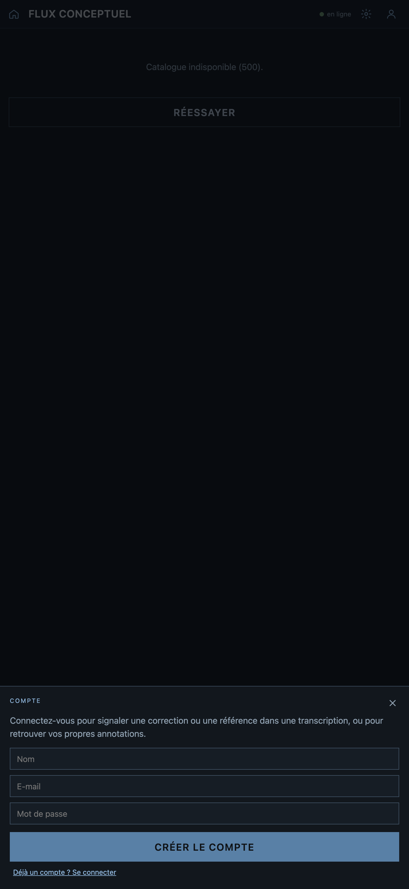
*Nom (facultatif), e-mail, mot de passe (8 caractères minimum). Le mot de passe n'est jamais stocké en clair côté serveur.*

Une fois connecté, votre nom et la façon dont vous êtes connecté s'affichent, avec un accès direct à « Mes annotations » :

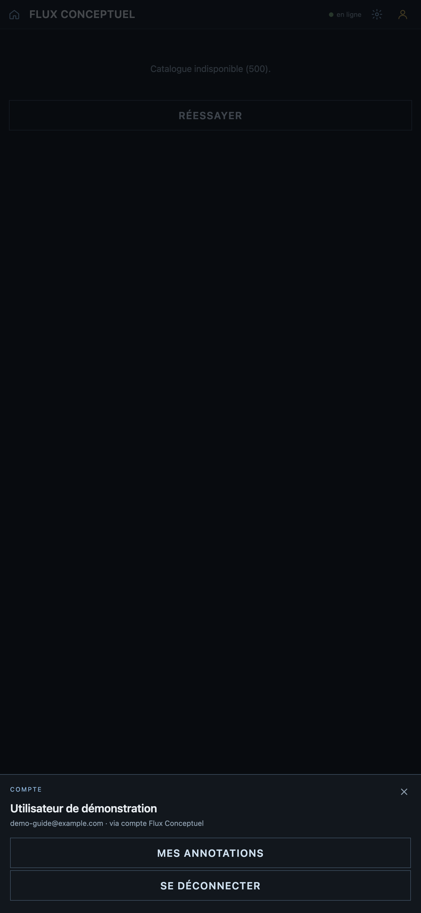

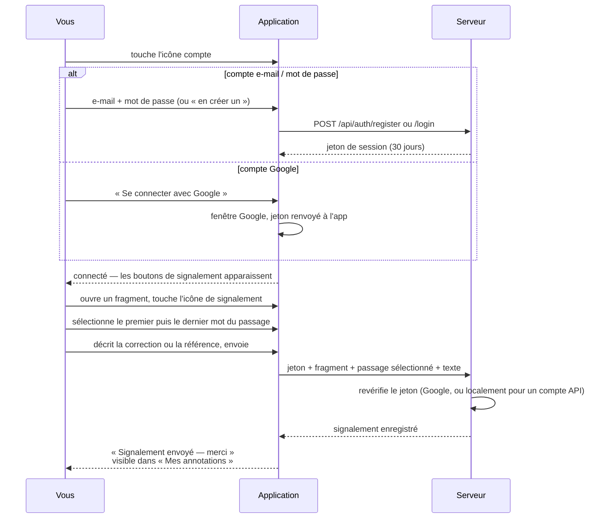
```mermaid
sequenceDiagram
    participant U as Vous
    participant App as Application
    participant API as Serveur

    U->>App: touche l'icône compte
    alt compte e-mail / mot de passe
        U->>App: e-mail + mot de passe (ou « en créer un »)
        App->>API: POST /api/auth/register ou /login
        API-->>App: jeton de session (30 jours)
    else compte Google
        U->>App: « Se connecter avec Google »
        App->>App: fenêtre Google, jeton renvoyé à l'app
    end
    App-->>U: connecté — les boutons de signalement apparaissent

    U->>App: ouvre un fragment, touche l'icône de signalement
    U->>App: sélectionne le premier puis le dernier mot du passage
    U->>App: décrit la correction ou la référence, envoie
    App->>API: jeton + fragment + passage sélectionné + texte
    API->>API: revérifie le jeton (Google, ou localement pour un compte API)
    API-->>App: signalement enregistré
    App-->>U: « Signalement envoyé — merci »<br/>visible dans « Mes annotations »
```

## Signaler une correction ou une référence

Une fois connecté, cinq icônes apparaissent dans le lecteur : corriger la transcription, ou signaler une référence à une **personne**, une **œuvre**, une **date/période**, ou un **lieu**.

Touchez-en une : le texte du fragment devient sélectionnable. Touchez le **premier mot** du passage concerné, puis le **dernier** (ou le même mot deux fois pour un seul mot) :

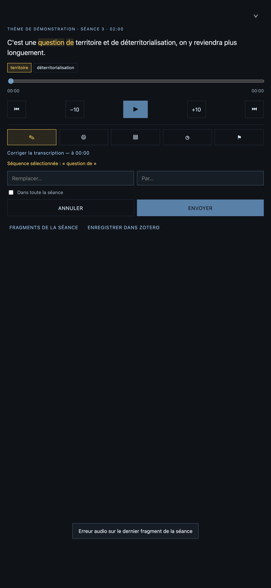
*La séquence sélectionnée s'affiche en clair au-dessus du formulaire — elle est obligatoire, un signalement ne peut pas être envoyé sans elle.*

Remplissez le formulaire — pour une correction, le texte à remplacer et le remplacement ; pour une référence, une description libre — puis envoyez :

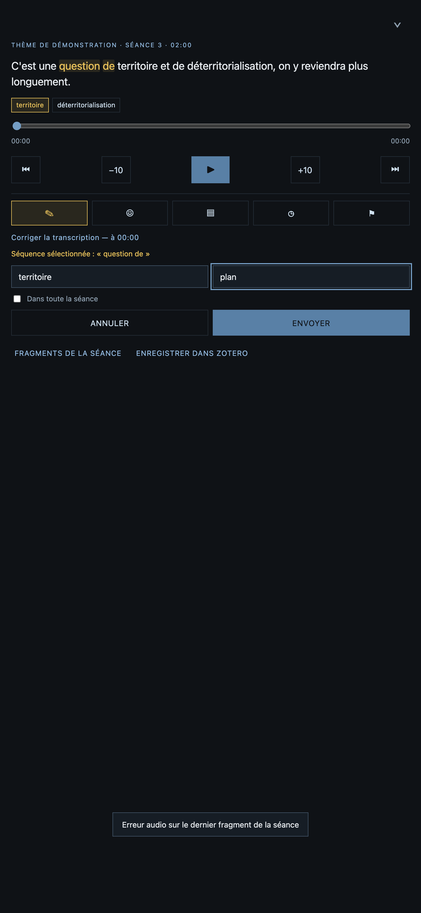
*« Dans toute la séance » applique la correction à toutes les occurrences du passage, pas seulement celle-ci.*

## Retrouver ses annotations

« Mes annotations », accessible depuis la feuille Compte une fois connecté, liste tous vos signalements — type, contenu, horodatage, statut de traitement :

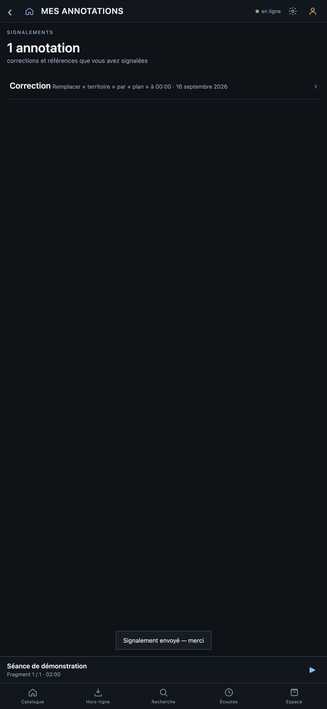
*Touchez une entrée pour rouvrir le fragment concerné.*

Les signalements déjà créés par **d'autres utilisateurs** sur un fragment s'affichent aussi directement dans le lecteur, sous les concepts détectés — public, sans avoir besoin d'être connecté pour les consulter.

## Extraire un passage vers Zotero

Dans le lecteur, « Enregistrer dans Zotero » propose de découper l'audio sur un passage précis (pas le fragment entier) et de l'envoyer dans votre bibliothèque Zotero personnelle.

Sélectionnez le passage exactement comme pour un signalement (premier mot, puis dernier) :

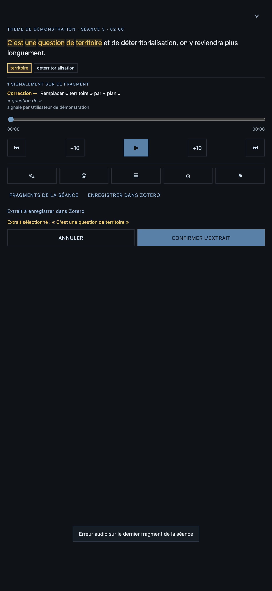

La première fois, l'application demande votre identifiant et une clé API Zotero (avec droit d'écriture) :

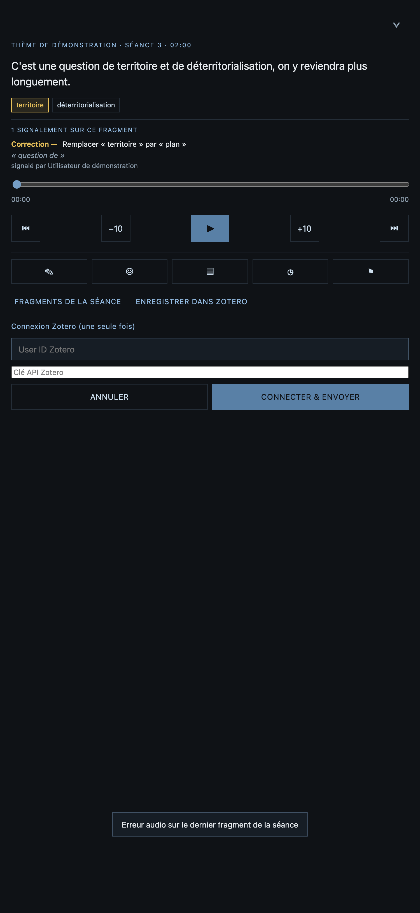
*Ces identifiants restent stockés localement sur l'appareil, jamais transmis ailleurs qu'à l'API Zotero elle-même.*

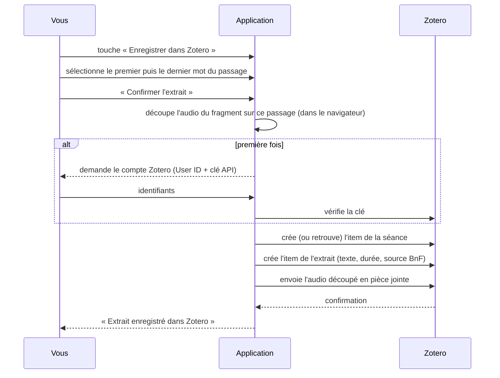
```mermaid
sequenceDiagram
    participant U as Vous
    participant App as Application
    participant Zot as Zotero

    U->>App: touche « Enregistrer dans Zotero »
    U->>App: sélectionne le premier puis le dernier mot du passage
    U->>App: « Confirmer l'extrait »
    App->>App: découpe l'audio du fragment sur ce passage (dans le navigateur)

    alt première fois
        App-->>U: demande le compte Zotero (User ID + clé API)
        U->>App: identifiants
        App->>Zot: vérifie la clé
    end

    App->>Zot: crée (ou retrouve) l'item de la séance
    App->>Zot: crée l'item de l'extrait (texte, durée, source BnF)
    App->>Zot: envoie l'audio découpé en pièce jointe
    Zot-->>App: confirmation
    App-->>U: « Extrait enregistré dans Zotero »
```

> La fenêtre temporelle de l'extrait est une **estimation** (proportionnelle à la position des mots sélectionnés dans le texte), pas une coupe exacte au mot près — cette application n'a pas d'horodatage par mot dans ses données.

## Gérer l'espace de stockage

L'onglet **Espace** montre le poids total téléchargé, le quota estimé du navigateur, et la liste des séances disponibles hors-ligne (avec suppression individuelle ou totale). Un bouton propose de demander un **stockage persistant**, pour réduire le risque que le navigateur efface les données automatiquement en cas de manque de place.

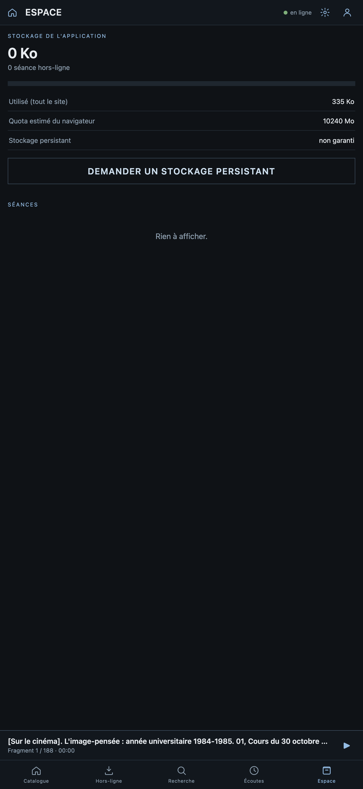

## Paramètres

L'icône engrenage (à côté de l'icône compte) ouvre un écran avec le numéro de version de l'application (commit du dépôt), un lien vers le code source, un lien vers la documentation, et un bouton pour vérifier explicitement les mises à jour.

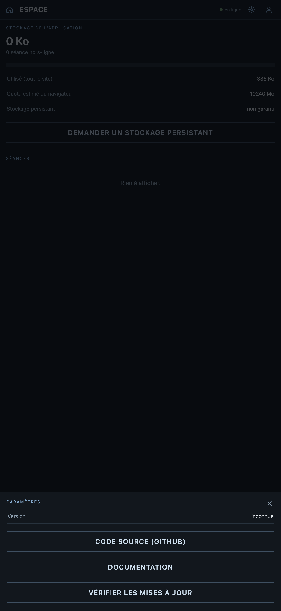
*Le bouton force une revalidation puis recharge la page — l'application se met normalement à jour toute seule au chargement suivant, ce bouton sert surtout à forcer la vérification tout de suite.*

## Modèle de données

Vue d'ensemble des notions manipulées par l'application et de leurs relations :

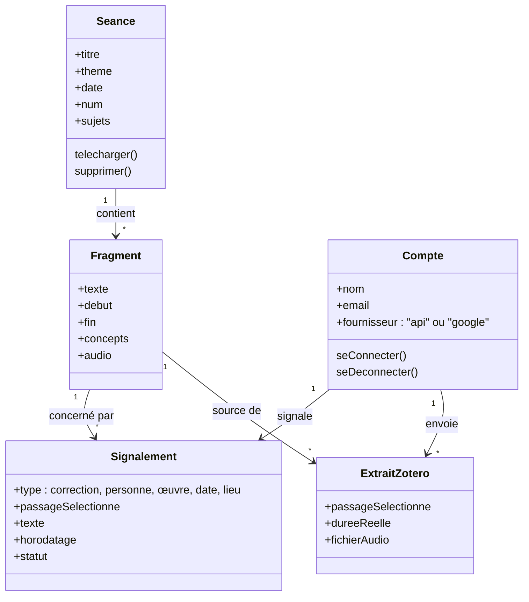
```mermaid
classDiagram
    class Seance {
        +titre
        +theme
        +date
        +num
        +sujets
        telecharger()
        supprimer()
    }
    class Fragment {
        +texte
        +debut
        +fin
        +concepts
        +audio
    }
    class Compte {
        +nom
        +email
        +fournisseur : "api" ou "google"
        seConnecter()
        seDeconnecter()
    }
    class Signalement {
        +type : correction, personne, œuvre, date, lieu
        +passageSelectionne
        +texte
        +horodatage
        +statut
    }
    class ExtraitZotero {
        +passageSelectionne
        +dureeReelle
        +fichierAudio
    }

    Seance "1" --> "*" Fragment : contient
    Compte "1" --> "*" Signalement : signale
    Fragment "1" --> "*" Signalement : concerné par
    Fragment "1" --> "*" ExtraitZotero : source de
    Compte "1" --> "*" ExtraitZotero : envoie
```

## Questions fréquentes

**Je ne vois aucun bouton pour signaler une correction.** Il faut être connecté (icône compte, en haut à droite) — les cinq icônes de signalement n'apparaissent que dans le lecteur, une fois connecté.

**« Sélectionnez la séquence de mots concernée » — je ne peux pas envoyer mon signalement.** La sélection d'un passage (premier mot puis dernier) est obligatoire, aussi bien pour un signalement que pour un extrait Zotero.

**Je ne suis pas connecté à Zotero mais j'ai un compte Flux Conceptuel — pourquoi le formulaire Zotero réapparaît ?** Ce sont deux comptes indépendants : le compte de l'application sert aux signalements, le compte Zotero (User ID + clé API) sert uniquement à l'export d'extraits audio.

**L'écran Paramètres affiche « Version : inconnue ».** Le numéro de version dépend d'un outil (`git`) disponible côté serveur ; si ce n'est pas le cas, la version reste simplement non affichée — cela n'affecte aucune autre fonctionnalité.

**La lecture s'arrête toute seule pendant que j'écoute.** Ça ne devrait plus arriver : une erreur audio sur un fragment passe automatiquement au suivant, et un passage hors connexion reprend tout seul dès le retour du réseau. Si ça persiste, c'est à signaler au responsable du serveur.
