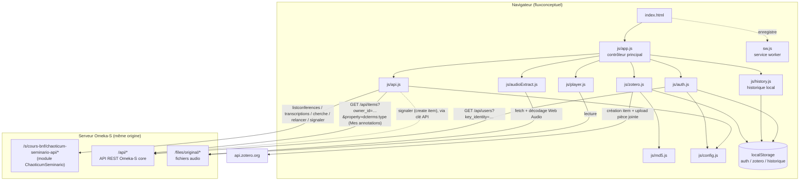
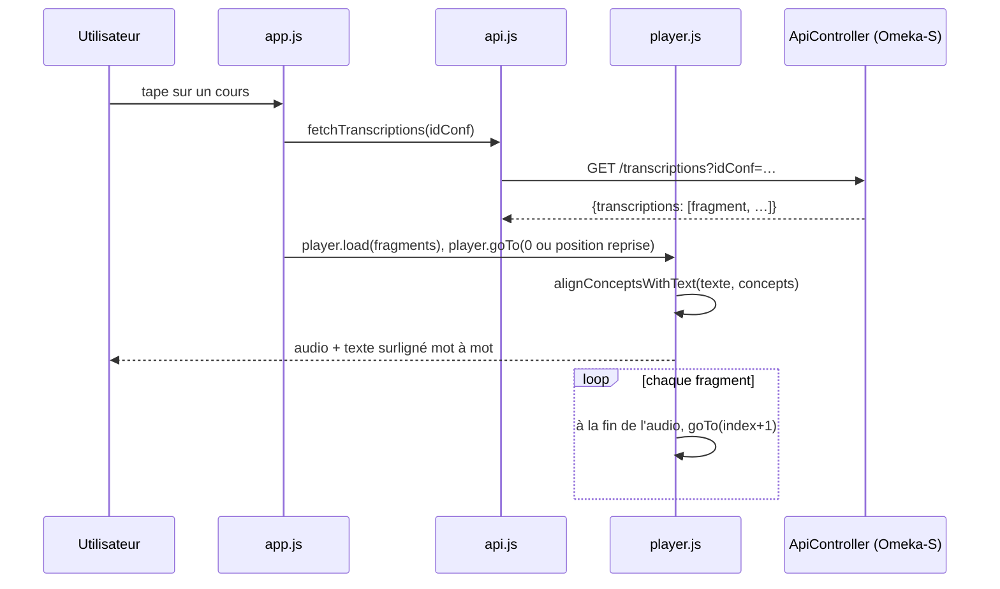
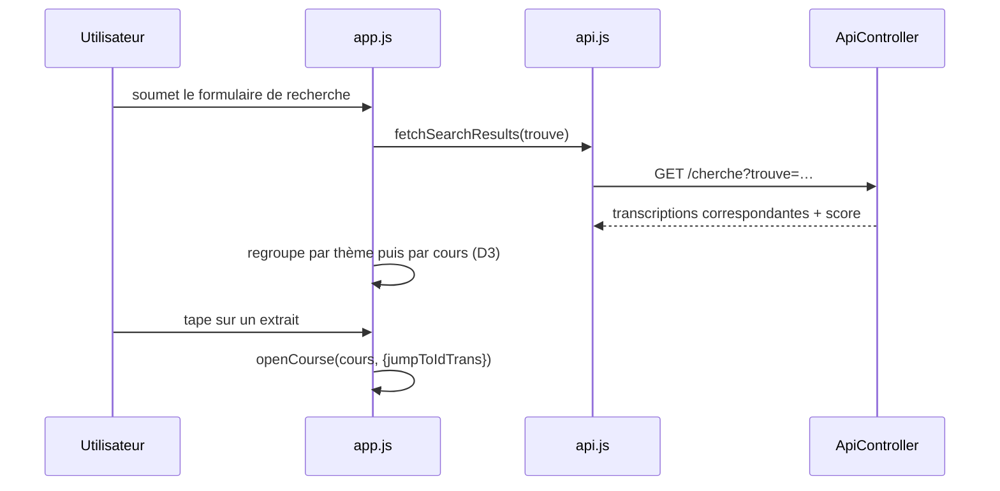
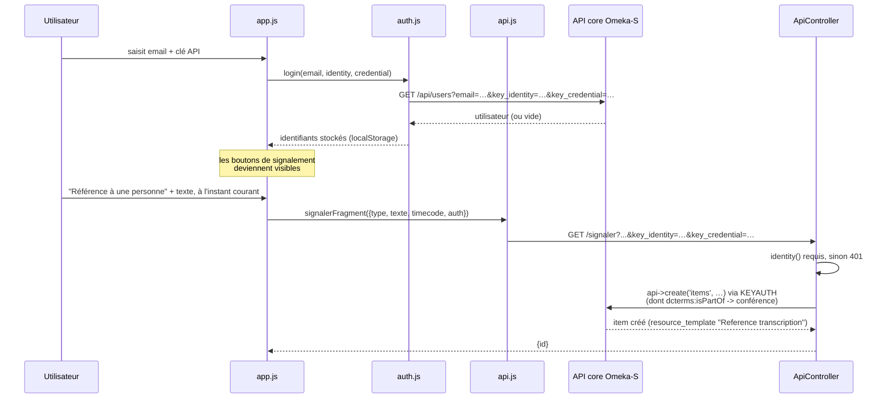
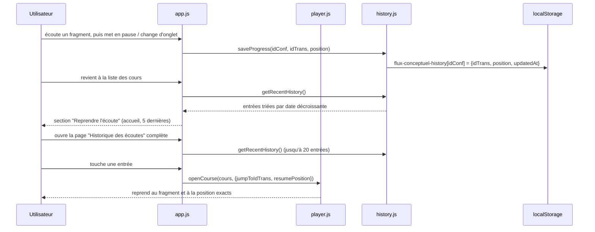
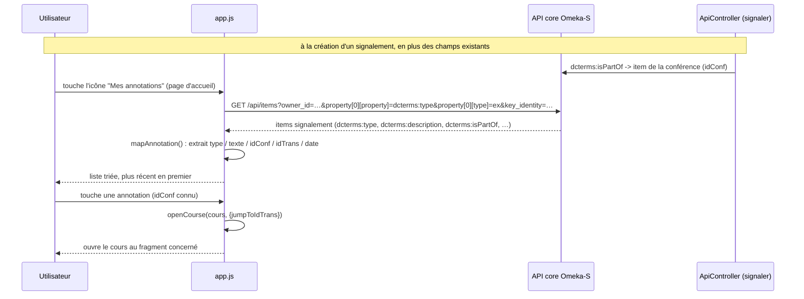
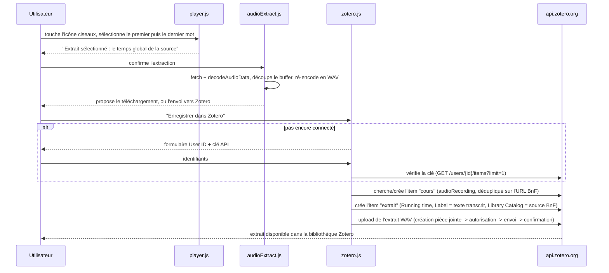
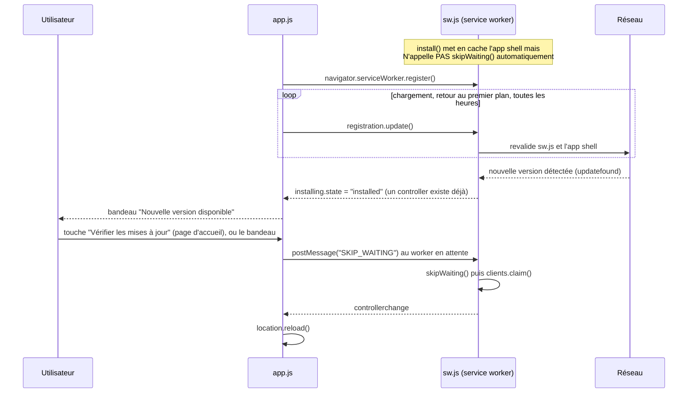

# Flux Conceptuel

Application mobile (PWA) d'exploration et d'écoute des cours de Gilles Deleuze enregistrés à l'université Paris 8. Elle consomme l'API JSON du module Omeka-S [ChaoticumSeminario](../../../omk_deleuze/modules/ChaoticumSeminario) hébergé sur le même serveur Apache.

## Présentation

- Parcourir les cours (groupés par thème, avec un extrait textuel représentatif — début, milieu, fin de la séance) et les rechercher par mot-clé, y compris en plein texte dans les transcriptions.
- Écouter un cours fragment par fragment : chaque fragment enchaîne automatiquement sur le suivant, avec le texte complet affiché et surligné mot à mot en synchronisation avec l'audio, et le temps écoulé/total affiché en continu (indépendamment des changements de disque BnF).
- **Historique d'écoute** : la position atteinte dans chaque cours est mémorisée localement ; une section "Reprendre l'écoute" sur l'accueil (5 dernières) et une page dédiée (jusqu'à 20 entrées, avec suppression individuelle ou totale) permettent de reprendre exactement où on s'était arrêté.
- Copier une référence du fragment en cours (lien BnF + horodatage), ou le partager (lien profond vers l'appli).
- **Extraire un passage audio** : sélectionner le premier et le dernier mot d'un passage, découper l'audio correspondant (Web Audio API, entièrement côté client) et l'enregistrer dans une bibliothèque Zotero personnelle — un item par cours (dédupliqué sur le lien BnF) et un item par extrait, avec le texte transcrit, la position temporelle et la source BnF en pièce jointe.
- Se connecter avec un compte Omeka-S (email + clé API) pour signaler une correction ou une référence (personne, œuvre, date/période, lieu) avec l'horodatage courant, ou relancer la transcription d'un fragment avec un autre modèle.
- **Mes annotations** : retrouver tous ses propres signalements (lus directement dans l'API cœur d'Omeka-S), avec un accès direct au fragment concerné.
- **Vérification des mises à jour** : le service worker installe une nouvelle version en tâche de fond mais attend une confirmation avant de l'activer (bandeau, ou bouton "Vérifier les mises à jour" sur l'accueil) — jamais de rechargement surprise pendant une écoute.

Aucune dépendance externe au runtime hors CDN : D3.js est chargé depuis un CDN pour le rendu de la liste/recherche, tout le reste (police d'icônes FontAwesome, assets) est servi localement et mis en cache par le service worker pour un usage hors-ligne partiel.

## Architecture

```
fluxconceptuel/
├── index.html          # Vues : liste des cours, historique, mes annotations, lecteur
├── manifest.json        # Manifeste PWA
├── sw.js                 # Service worker (cache de l'app shell, versionné)
├── icon.svg
├── css/
│   ├── style.css
│   └── fontawesome.min.css
├── webfonts/             # Police FontAwesome (solid uniquement)
├── img/                  # Logos
├── data/
│   └── listconferences.json   # Cache statique de la liste des cours (avec extrait textuel)
└── js/
    ├── config.js         # URL de base Omeka-S (OMK_BASE / API_BASE)
    ├── api.js             # Appels à l'API JSON ChaoticumSeminario + Omeka core
    ├── auth.js            # Connexion Omeka-S (email + clé API), stockage localStorage
    ├── history.js         # Historique d'écoute (position par cours), localStorage
    ├── player.js           # Lecture audio, alignement texte/concepts, sélection de mots
    ├── audioExtract.js     # Découpe d'une plage audio et encodage WAV (Web Audio API)
    ├── zotero.js           # Client API Zotero (création d'items, upload de pièce jointe)
    ├── md5.js              # MD5 sur ArrayBuffer (requis par l'upload Zotero)
    └── app.js              # Contrôleur principal : vues, recherche, signalements, mises à jour
```



Chaque fichier JS interne est importé avec un paramètre de version (`?v=N`, synchronisé avec la constante `CACHE` de `sw.js` et le tag `<script>` d'`index.html`) : Apache ne renvoyant pas d'en-tête `Cache-Control` explicite, le navigateur peut mettre en cache un module de façon agressive et ne jamais revalider un fichier modifié sans ce changement d'URL.

## Modèle de données consommé

Chaque **cours** listé par `listconferences` porte, en plus de ses métadonnées, un `extrait` : trois fragments répartis sur toute la séance (début, milieu, fin — calculés côté module via une fonction SQL fenêtrée), tronqués sur un mot entier et joints par une ellipse, pour donner un aperçu du contenu réel dans la liste plutôt que la seule liste des sujets BnF.

Chaque **fragment** (~50 s) renvoyé par `transcriptions?idConf=` contient l'audio propre à ce fragment, le texte complet ponctué (`texte`) et la liste des tokens ASR (`concepts`, un mot ou un signe de ponctuation par entrée avec son `start`/`end` en secondes, relatifs au début du fragment) :

```json
{
  "idTrans": 1271469, "idFrag": 1271145, "idConf": 72556,
  "theme": "Appareils d'État et machines de guerre", "num": 1,
  "start": 0, "end": 50, "source": "files/original/....flac",
  "gallica": "https://gallica.bnf.fr/ark:/12148/....audio",
  "texte": "Cette année, j'ai plusieurs choses à vous proposer…",
  "concepts": [
    { "title": "cette", "start": 0, "end": 1.52, "confidence": 0.68 }
  ]
}
```

`js/player.js` aligne ces tokens bruts sur le texte ponctué (`alignConceptsWithText`) pour surligner le bon mot dans une vraie phrase, plutôt que d'afficher les tokens isolés — et réutilise cet alignement pour la sélection d'une séquence de mots (extraction audio).

## Flux principaux

### Lecture d'un cours



### Recherche plein texte



### Connexion et signalement



### Historique d'écoute et reprise



### Mes annotations



Lire ses propres signalements ne passe pas par le module ChaoticumSeminario mais directement par l'API cœur d'Omeka-S (déjà utilisée par `auth.js` pour la connexion) : `dcterms:type` identifie sans ambiguïté les items créés par `signalerFragment`, et `owner_id` restreint aux items du compte connecté.

### Extraction audio et export Zotero



### Vérification des mises à jour



Le bouton "Vérifier les mises à jour" ne fait qu'accélérer la détection (`registration.update()`) — l'activation reste toujours soumise à la confirmation de l'utilisateur (bandeau), jamais automatique, pour ne pas interrompre une écoute en cours.

## Déploiement

- Servir le dossier tel quel sous le **même domaine** que l'installation Omeka-S (voir `js/config.js` : `OMK_BASE`) — l'API n'envoie pas d'en-têtes CORS, il faut donc rester same-origin.
- Le service worker (`sw.js`) précharge l'app shell ; sa constante `CACHE`, le tag `<script>` d'`index.html` et **chaque import interne versionné** (`?v=N` dans les `import` de `js/*.js` et dans `APP_SHELL`) doivent être incrémentés ensemble à chaque déploiement pour invalider le cache des navigateurs déjà installés en PWA.
- `data/listconferences.json` est un instantané régénéré manuellement (`curl` de l'endpoint `listconferences` du module) plutôt qu'interrogé en direct — à refaire après toute modification des cours/transcriptions dans Omeka S.
