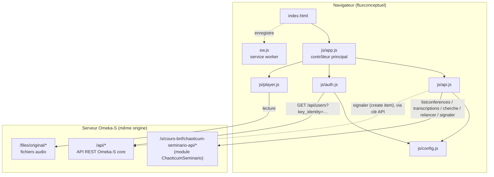
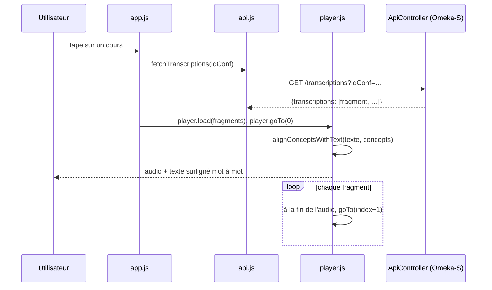
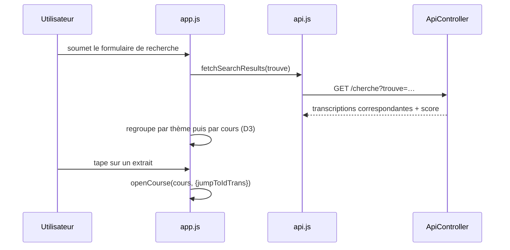
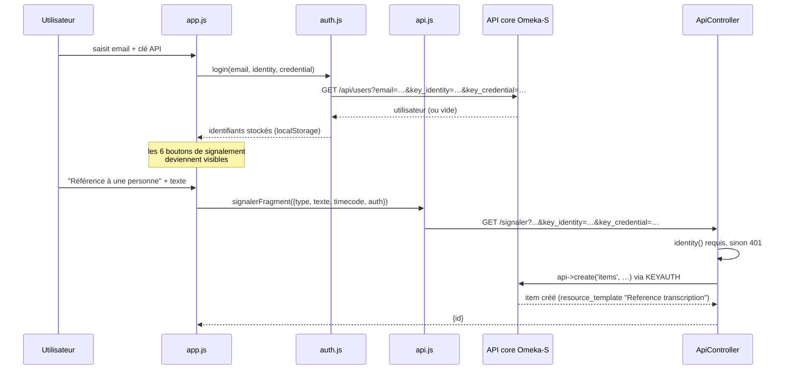

# Flux Conceptuel

Application mobile (PWA) d'exploration et d'écoute des cours de Gilles Deleuze enregistrés à l'université Paris 8. Elle consomme l'API JSON du module Omeka-S [ChaoticumSeminario](../../../../omk_deleuze/modules/ChaoticumSeminario) hébergé sur le même serveur Apache.

## Présentation

- Parcourir les cours (groupés par thème) et les rechercher par mot-clé, y compris en plein texte dans les transcriptions.
- Écouter un cours fragment par fragment : chaque fragment enchaîne automatiquement sur le suivant, avec le texte complet affiché et surligné mot à mot en synchronisation avec l'audio.
- Copier une référence du fragment en cours (lien BnF + horodatage), ou le partager (lien profond vers l'appli).
- Se connecter avec un compte Omeka-S (email + clé API) pour signaler une correction ou une référence (personne, œuvre, date/période, lieu), ou relancer la transcription d'un fragment avec un autre modèle.

Aucune dépendance externe au runtime (pas de CDN) : D3.js est chargé depuis un CDN pour le rendu de la liste/recherche, tout le reste (police d'icônes FontAwesome, assets) est servi localement et mis en cache par le service worker pour un usage hors-ligne partiel.

## Architecture

```
fluxconceptuel/
├── index.html          # Deux vues : liste des cours / lecteur de fragments
├── manifest.json        # Manifeste PWA
├── sw.js                 # Service worker (cache de l'app shell)
├── icon.svg
├── css/
│   ├── style.css
│   └── fontawesome.min.css
├── webfonts/             # Police FontAwesome (solid uniquement)
├── img/                  # Logos
├── data/
│   └── listconferences.json   # Cache statique de la liste des cours
└── js/
    ├── config.js         # URL de base Omeka-S (OMK_BASE / API_BASE)
    ├── api.js             # Appels à l'API JSON ChaoticumSeminario + Omeka core
    ├── auth.js            # Connexion Omeka-S (email + clé API), stockage localStorage
    ├── player.js          # Lecture audio, alignement texte/concepts, synchronisation
    └── app.js              # Contrôleur principal : vues, recherche, signalements
```



## Modèle de données consommé

Chaque **fragment** (~50 s) renvoyé par l'API contient l'audio propre à ce fragment, le texte complet ponctué (`texte`) et la liste des tokens ASR (`concepts`, un mot ou un signe de ponctuation par entrée avec son `start`/`end` en secondes, relatifs au début du fragment) :

```json
{
  "idTrans": 1271469, "idFrag": 1271145, "idConf": 72556,
  "theme": "Appareils d'État et machines de guerre", "num": 1,
  "start": 0, "end": 50, "source": "files/original/....flac",
  "gallica": "https://gallica.bnf.fr/ark:/12148/....audio",
  "texte": "Cette année, j'ai plusieurs choses à vous proposer…",
  "concepts": [
    { "title": "cette", "start": 0, "end": 1.52, "confidence": 0.68 }
  ]
}
```

`js/player.js` aligne ces tokens bruts sur le texte ponctué (`alignConceptsWithText`) pour surligner le bon mot dans une vraie phrase, plutôt que d'afficher les tokens isolés.

## Flux principaux

### Lecture d'un cours



### Recherche plein texte



### Connexion et signalement



## Déploiement

- Servir le dossier tel quel sous le **même domaine** que l'installation Omeka-S (voir `js/config.js` : `OMK_BASE`) — l'API n'envoie pas d'en-têtes CORS, il faut donc rester same-origin.
- Le service worker (`sw.js`) précharge l'app shell ; sa constante `CACHE` doit être incrémentée à chaque déploiement pour invalider le cache des navigateurs déjà installés en PWA.
